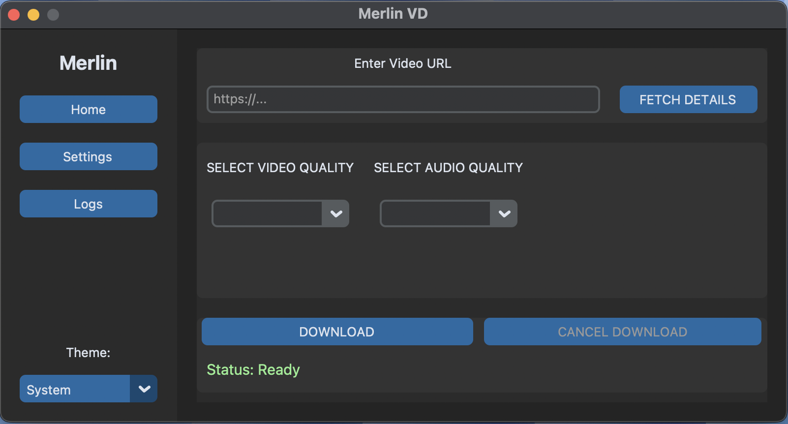
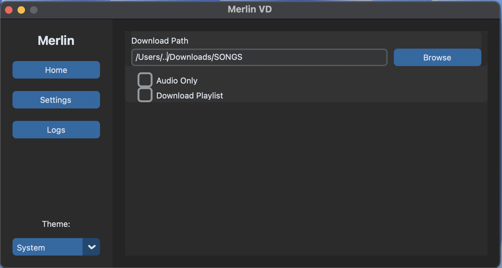
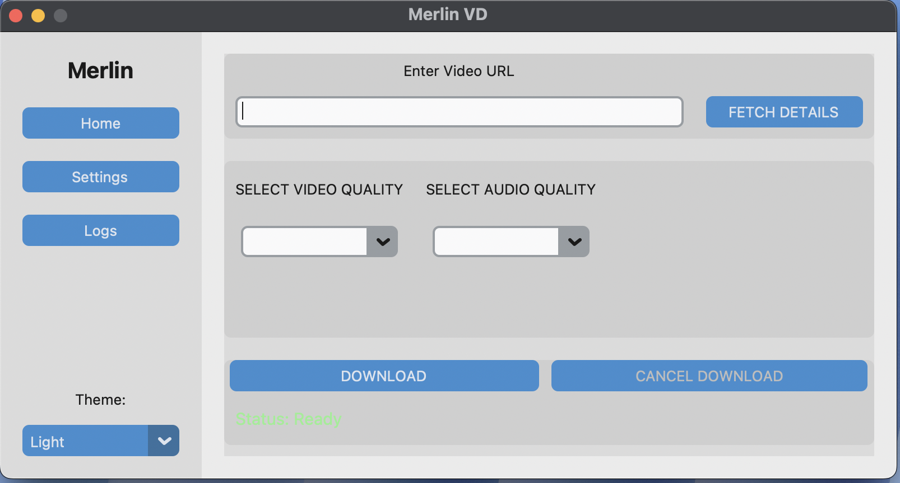
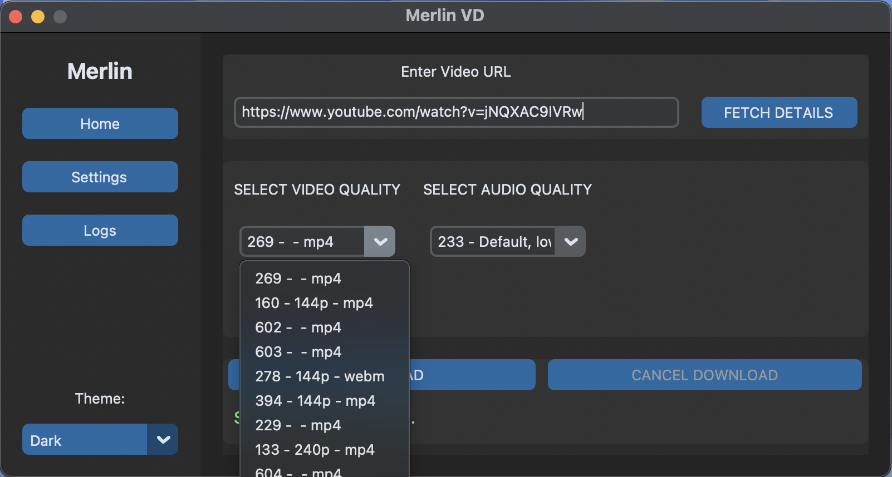
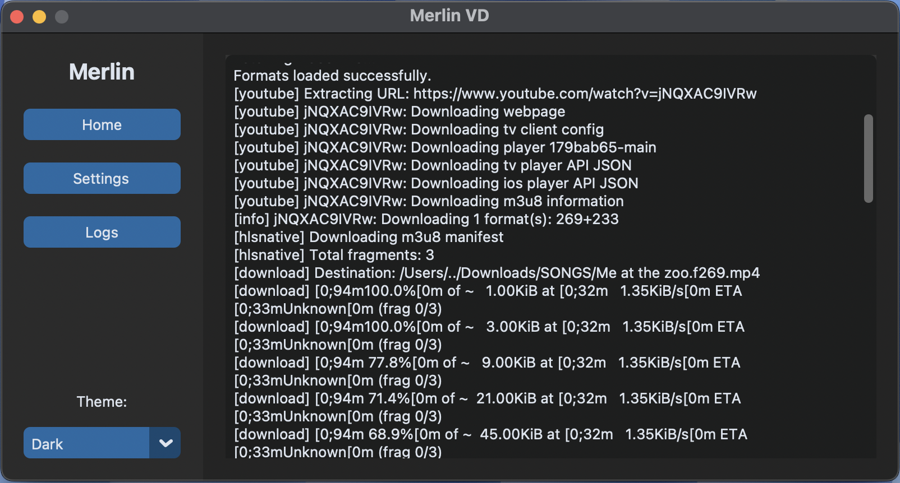

# Merlin

# Setup
1. Activate virtual environment
2. Install requirements using `pip install -r requirements.txt`
3. Run `python3 main.py`

# UI

**Home Page**

**Settings Page**

**Light Theme**

**Fetching Video Details**

**Download Logs**
